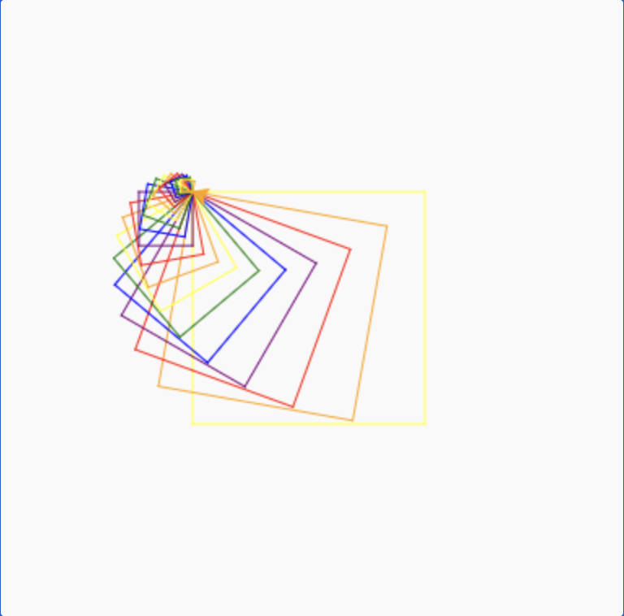
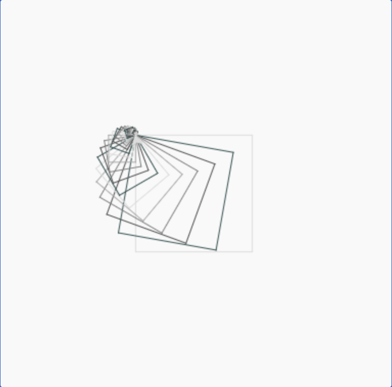

# recursion
draw() function calls itself  
stops when there are no more levels  
draws a square, turns a little, makes a smaller square  

# running
use trinket turtle  
pick a color  
pick how many levels (10-40)  
pick starting size of square (50-200)  

# examples
rainbow, 20, 150, lots of colorful squares  
greys, 30, 120, lots of grey squares  

# tests
# rainbow, 20, 150, draws 20 squares (less sqaures but bigger)

# greys, 30, 120, draws 30 squares (more squares but smaller)

# recursion levels
less than 10, not enough squares for cool spiral  
more than 50, too slow, squares too small  
10-40, looks cool and not too slow  

# debugging
putting first square in the middle  
made choosing colours easier  
made squares smaller each time so they fit on screen  
print("- ", colour) swapped to print("- " + colour)  

# peer review
gabe thinks the project is cool and unique. just handle invalid inputs  
Code is well documented and very easy to read. User interface is great and there are some fallback for invalid input. Overall a great program -Nguyen  
Nguyen helped add a black background with screen.bgcolor()  
use comments to make each section of code readable and was to understand  